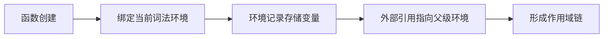

### 1. 数据运算

#### 1.1 布尔判定

| 数据                                                      | 判定    |
| --------------------------------------------------------- | ------- |
| **假值**：`false`、`null`、`undefined`、`Nan`、`0`、`' '` | `false` |
| 其余所有（如：`[]`，`{}`...）                             | true    |

#### 1.2 逻辑运算

- `||`：左侧是假值就返回右侧
- `??`：左侧是 **`null/undefined`**则返回右侧
- `&&`：两侧都是真值则返回右侧

-  `&&`、 `||`  返回**最后一个判定的数据**


```javascript
1 && 2 --> 2
1 || 2 --> 2
```


### 2. `JavaScript` 事件处理

#### 2.1 事件冒泡

##### 2.1.1 定义

事件冒泡是 `JavaScript` 中的一种**事件传递机制**，事件流呈现**从最内层向最外层依次传递**的顺序，是浏览器的默认方式

##### 2.1.2 使用

```javascript
const spanEl = document.querySelector('span')
const divEl = document.querySelector('div')

spanEl.addEventListener('click', function (){
	console.log('span click')
})

divEl.addEventListener('click', function (){
	console.log('div click')
})

// 事件流动：span -> div
```

##### 2.1.3 阻止事件冒泡

`event.stop`

#### 2.2 事件捕获

##### 2.2.1 定义

事件捕获是 `JavaScript` 中的一种**事件传递机制**，事件流呈现**从最外层向最内层依次传递**的顺序

> 注意：如果同时监听捕获和冒泡，则会**依次经历**三个阶段
>
> - **捕获阶段**：事件向下捕获
> - **目标阶段**：事件到达目标元素
> - **冒泡阶段**：事件向上冒泡

##### 2.2.2 使用

```javascript
const spanEl = document.querySelector('span')
const divEl = document.querySelector('div')

spanEl.addEventListener('click', function (){
	console.log('span click')
}, true)

divEl.addEventListener('click', function (){
	console.log('div click')
}, true)

// 事件流动：div -> span
```

#### 2.3 事件对象 `event`

##### 2.3.1 `event` 属性

- **`event.type`**：事件类型

- **`event.target`**：实际**触发事件**的元素

- **`event.currentTarget`**：当前**处理事件**的元素
- **`event.eventPharse`**：事件所处的阶段
  - 1：捕获阶段
  - 2：目标元素
  - 3：冒泡阶段

##### 2.3.2 `event` 方法

- **`evtnt.prevetnDedault()`：阻止事件默认行为**
- **`event.stopPropagation`：阻止事件传递（冒泡、捕获）**

#### 2.4 事件委托

##### 2.4.1 定义

事件委托是 `JavaScript` 中的一**种事件处理机制**，它允许开发者**将事件监听器绑定到父元素**，而不是每个子元素。当某个子元素触发事件时，事件会 **冒泡** 到父元素，由父元素来处理该事件

##### 2.4.2 优势

- **性能优化**：对于具有大量子元素的父元素，逐个为每个子元素绑定事件监听器会耗费大量内存，而**事件委托只需要为父元素绑定一次事件监听器，从而节省资源，提升页面性能**
- **动态元素处理**：事件委托可以处理动态生成的子元素，无需重新绑定事件监听器
- **代码简洁**：减少了重复的事件绑定代码，提高了代码的可维护性

```javascript
<ul id="dynamicList">
  <li>Item A</li>
  <li>Item B</li>
  <li>Item C</li>
</ul>

<button id="addItem">Add Item</button>

// ----- script -----
const ul = document.getElementById('dynamicList');
const addItemButton = document.getElementById('addItem');

// 使用事件委托绑定点击事件
ul.addEventListener('click', (event) => {
  if (event.target.tagName === 'LI') {
    // 获取每个 li 的索引
    console.log(`Clicked: ${event.target.id}`);
  }
});

// 动态添加新列表项
addItemButton.addEventListener('click', () => {
  const newItem = document.createElement('li');
  newItem.textContent = `Item ${ul.children.length + 1}`;
  ul.appendChild(newItem);
});

```


### 3. this 指向与绑定

- `this` 总是==返回一个**对象**==

* `this` 的值**==在函数被调用时被确定==**，与函数定义的位置没有关系
* **在函数执行过程中，`this`一旦被确定，就不可更改了**。

#### 3.1 以==函数的形式==调用 `fn()` 时，this 默认指向==全局对象==

- 浏览器中 `this` 指向 `window`，`Nodejs` 中指向 `global`

> 注意：**严格模式下，`this` 会被绑定到 `undefined` 下**

```js
function showThis() {
  console.log(this);
}

// 严格模式（'use strict'）下输出: undefined
showThis(); // 浏览器中输出: Window {...}（非严格模式）
```

```javascript
var foo = {
    bar:10;
    fn(){
        console.log(this)
        console.log(this.bar)
    }
}

var fn2 = foo.fn
fn() //  输出: window undefined
fn2() // 输出: window undefined

// 解析： fn2() 等价于直接调用 fn() 此时 fn 的 this 指向全局对象 window，并且 window 下是
//       不存在 bar 属性的，因此输出 undefined

function fn3(fn){
    fn()
}

fn3(foo.bar)  // 输出: window undefined
```

#### 3.2 当函数作为==对象的方法==调用时，`this` 指向调用该对象

```js
const user = {
  name: "小明",
  greet: function() {
    console.log(this.name); // this → user 对象
  }
};

user.greet(); // 输出: "小明"
```

⚠️ ==**隐式丢失陷阱**：**方法被赋值后调用会丢失原对象绑定！**==

```js
const greet = user.greet;
// 此时可以视为函数被独立调用，故 this 指向了全局对象 window 或 undefined(严格模式下)
greet(); // 输出: undefined（严格模式）或全局对象上的 name（非严格模式）
```

#### 3.3 使用 `new` 方法调用构造函数，`this` 指向该对象

> 构造函数与原型对象的 `this` 都被实例对象所拥有，**每个实例对象的 `this` 都是独立的**

```js
function Person(name, age) {
    this.name = name;
    this.age = age; 
}

Person.prototype.getName = function() {
     return this.name;
  }

// nick 为 Person 的实例对象，因此 Person 中的 this 指向 nick
var nick = new Person(’Nick‘, 20);
// nick 使 getName 函数的调用者，因此 getName 函数中的 this 也指向 nick
nick.getName();
```

通过 `new` 操作符调用构造函数，会经历以下4个阶段：

* 创建一个新的对象；

* **==将构造函数的`this`指向这个新创建的实例对象==**；

* 指向构造函数的代码，为这个对象添加属性，方法等；

* 返回新对象

#### 3.4 箭头函数的 `this` 指向

==箭头函数并**没有属于⾃⼰的`this`**==，它所谓的`this`是**捕获其==外层作用域==的 `this` 值作为自己的`this` 值。

> 由于箭头函数没有属于⾃⼰的`this`，因此
>
> - 箭头函数**不能用作构造器 --> 因此不会被`new`调⽤**
> - 这个所谓的 **`this `不会被改变**

```js
const obj = { 
  getArrow() { 
    return () => { 
      console.log(this === obj); 
    }; 
  } 
}

var x = 20
const obj = { 
   x:10,
   test:() => { 
      console.log(this); 
      console.log(this.x); 
    }; 
  } 
}

obj.test() // 输出 window 20
// 解析：这里的 this 其实指向 obj 对象的外层，即浏览器 window
```

#### 3.5 内置函数的 `this` 指向

- **计时器**：计时器内部的 `this` 指向 `window`

- **绑定事件**：**事件处理函数的 `this` 指向==绑定事件==的元素**

  > 注意：**事件处理函数的 `target` 指向==触发事件==的元素**

#### 3.6 使用call、apply、bind显式指定 `this`

> 注意点：
>
> - 如果声明的 `this` 指向不是对象，则会将 `this`  包装为一个对象
> - 如果声明的 `this` 指向为 `undefined`，则默认将 `this` 绑定到 `window` 上

##### 3.6.1 `apply`

* `apply` 接受**两个参数**，**第一个参数指定了函数体内 this 对象的指向**， 第二个参数为一个带下标的**集合**，这个**集合可以为数组，也可以为类数组（`arguments` 数组**），`apply` 方法把这个集合中的元素作为参数传递给被调用的函数。 

```javascript
function fn(num1, num2) {
    console.log(this.a + num1 + num2);
}
var obj = {
    a: 20
}

fn.call(obj, [100, 10]); // 130 --> 通过 apply 将 fn 的 this 指向 obj
```

##### 3.6.2 `call`

* `call` 接受**多个参数**，**第一个参数指定了函数体内 this 对象的指向**，从第二个参数开始往后，每个参数被依次传入函数

* 注意：

  * **==如果 `call/apply` 传递的对象为 `''/null/undefined` 则此时 `this` 仍指向全局==**
  * **如果传递的值为 `number/true` 等类型，则 `this` 会指向对应的==包装对象==**


```js
function fn(num1, num2) {
    console.log(this.a + num1 + num2);
}
var obj = {
    a: 20
}

fn.call(obj, 100, 10); // 130 --> 通过 call 将 fn 的 this 指向 obj
```

##### 3.6.3 `bind`

- `bind` **==创建一个新的绑定函数==**，接受**多个参数**，**第一个参数指定了函数体内 this 对象的指向**

```javascript
function fn(num1, num2) {
    console.log(this.a + num1 + num2);
}
var obj = {
    a: 20
}

var bar = fn.bind(obj) // 通过 bind 将 fn 的 this 指向 obj后，生成一个新的函数赋值给 bar

// 即使是直接调用 bar，但是 bar 函数的 this 已经被显示指向了 obj，故 bar 的 this 指向 obj
bar(obj, 100, 10); // 130 
```


### 4. 执行上下文

#### 4.1 基本概念

执行上下文：可以看作是代码执行的**"运行环境"**，`javascript`中的所有代码都是在执行上下文中执行的。

执行栈：控制代码的**执行顺序**的**调用栈（后进先出）**。每当有函数被调用，都会在**栈顶**为该函数创建一个上下文，处于**栈顶的上下文会被优先执行**，执行完毕后弹出将控制权交还给下一个执行上下文。

在`javascript`中存在三种上下文，分别是：

- **全局上下文：进入代码时创建（window 对象），永远处于栈底**
- **函数上下文**：在 `function` 被函数调用时创建
- ~~`Eval` 函数上下文~~

#### 4.2 执行上下文生命周期

##### 4.2.1 创建阶段

在创建阶段，一共会处理三件事情，分别是：

- **确定this的值**
- 变量和函数声明（**将变量和函数加入到花名册**）
  - 变量声明又分为**变量环境**和**词法环境**
    - `var` 声明的变量和 `function` 声明的函数都存在变量提升，会被提升到**==当前作用域==的顶端**
  - **顶级函数声明会直接在全局声明该函数，并立即初始化创建该函数对象**

| **特性**           | **变量环境（Variable Environment）**           | **词法环境（Lexical Environment）**              |
| ------------------ | :--------------------------------------------- | :----------------------------------------------- |
| **存储内容**       | `var` 声明的变量、**顶级函数**声明             | `let/const` 声明的变量、块级作用域               |
| **作用域规则**     | 函数作用域或全局作用域                         | 块级作用域（如 `if/for`）                        |
| **变量提升**       | 存在并初始化为 `undefined`，挂载到 `window` 中 | 存在但不可访问`uninitialized`，挂载到 `scope` 中 |
| **块级作用域处理** | 无视块，穿透到函数或全局作用域                 | 严格遵循块级作用域                               |

```javascript
var a = 100 
// 1. var a: undefined --> 创建阶段
// 2. a = 100 --> 执行阶段
```

- **创建作用域链**（见下文）

##### 4.2.2 执行阶段

**按照代码顺序**依次进行**变量赋值**、**代码执行**、**函数引用**等操作

##### 4.2.3 销毁阶段


### 5. 作用域与作用域链

#### 5.1 什么是作用域 `Scope`

作用域是指**变量的==可用性代码范围==**，`javascript`中包含了三种不同的作用域，分别是：

- 全局作用域：通常是浏览器中的 `window` 对象或 `Node.js` 中的 `global` 对象

  - 在浏览器中，任何**在全局作用域中声明的变量都会被挂载到 `window`对象下** 

  ```javascript
  let globalVar = "Global Variable";
  console.log(window.globalVar);  // 输出：Global Variable
  ```

- 函数作用域：**函数执行时生成的作用域**，在函数内部生效

- 块级作用域：由`let/const` 声明加上最近的 `{}`所包裹的代码形成一个块级作用域。

```javascript
// { } 形成了一个块级做作用域
{
	let a = 100
    const b = 200
    console.log(a, b)
    
    // { } 属于内部的块级作用域
    {
        let c = 300
    }
}
```

==**作用域是分层的**，**内层作用域可以访问外层作用域**，反之不行==

```javascript
let globalVar = "I am global";  // 全局变量

function testScope() {
  let localVar = "I am local";  // 局部变量
  console.log(globalVar);  // 可以访问全局变量
  console.log(localVar);   // 可以访问局部变量
}

testScope();
console.log(globalVar);  // 可以访问全局变量，输出：I am global
console.log(localVar);   // 错误：外部作用域无法访问局部变量
```

#### 5.2 什么是作用域链

- 作用域链是 `javascript` 中用于**查找变量和函数**的一种机制，本质上是**变量查找的路径**。
- 每个 `javascript` 函数都会创建一个作用域链
- 如果**在自己作用域找不到该变量就去父级作用域查找**，依次向上级作用域查找，直到访问到全局对象就被终止。如果在整个作用域链中都无法找到该变量，则会抛出 `ReferenceError` 异常。

**作用域链保证了当前执行环境对符合访问权限的变量和函数的有序访问**，由于作用域链的存在，因此形成了一个新的概念：闭包

#### 5.3 闭包 `Closure`

##### 5.3.1 什么是闭包

- 闭包是一种特殊的**对象**，通过 **保留作用域链** 冻结变量。==**闭包 = 函数 + 其创建时所在的作用域链**==
- **通过闭包，我们可以在其他的执行上下文中，访问到函数的内部变量**



```javascript
function outerFunction() {
    let outerVariable = '我在outer函数里!';
  
    function innerFunction() {
      console.log(outerVariable);
    }
  
    return innerFunction;
  }
  
  const innerFunc = outerFunction();
  innerFunc(); // 输出: 我在outer函数里!
```

##### 5.3.2 闭包的使用场景

- 创建**私有变量**
- **==延长变量的生命周期==**，防止变量被回收 --> 可能导致**内存泄漏**
- **柯里化函数**：避免频繁调用具有相同参数函数的同时，又能够轻松的重用
- **计数器、延迟调用、回调等闭包的应用，其核心思想还是创建私有变量和延长变量的生命周期**


### 6. 原型与原型链

#### 6.1 原型与原型链的理解

**原型链**是实现==对象继承==的核心机制，要想完整理解对象集成，我们首先需要了解以下概念：

- **构造函数 constructor**：可通过 new 关键字调用的函数，如 Person()
  - **构造函数中的 `this` 就是实例 **
  - 构造函数的方法一般挂载到 `prototype` 上
- **实例对象**：构造函数通过 `new` 构造的对象 `const person = new Person()`，person 就是 Person 的实例。 
  - 实例对象包含一个 construct 属性指向他的构造函数 `person.constructor` 指向 Person()

- **原型对象 prototype**：也称**原型**，是构造函数的一个属性，包含实例对象所**共享**的属性和方法
  - ==原型对象永远指向另一个对象或者是 null==，我们也可以理解为**原型对象也是另外一个对象的实例**，因此我们可以通过 `__proto__`来获取"原型对象的原型对象"
  - 由于原型对象是构造函数的一部分，因此我们可以通过 `Person.prototype` 获取 Person 的原型对象，同理我们可以通过 `Person.prototype.constructor`来获取原型对象的构造函数
  - 我们可以通过 `person.__proto__`来获取实例原型，实例会从原型上继承属性和方法。也可以通过 `__proto__`来指定实例的原型。
  - **原型对象的 `this` 也指向当前实例本身**
- **原型链**：由原型对象层层继承的链接结构，通过 `__proto__` 属性链接
  - ==当实例对象上不存在某个属性或方法时，会**沿着原型链向上查找**，直到找到或者到达原型链顶端为止==
  - **原型链的顶端为 `Object.porototype`，原型链的终点为 null ，即 `Object.porototype --> null`**


#### 6.2 获取和写入原型

**继承的对象运行继承的方法时，它们将仅修改自己的状态，而不会修改 原型对象 的状态**

```javascript
// case 1
let user = {
  name: "John",
  surname: "Smith",

  set fullName(value) {
    [this.name, this.surname] = value.split(" ");
  },

  get fullName() {
    return `${this.name} ${this.surname}`;
  }
};

let admin = {
  __proto__: user,
  isAdmin: true
};

// 由于 admin 的原型 user 存在 name 和 surname 属性，因此会调用 get 直接获取
alert(admin.fullName); 

// 此时调用了 set 方法修改了实例对象admin的 name 和 surname 属性，此时的 this 为 admin
admin.fullName = "Alice Cooper"; 

alert(admin.fullName); // Alice Cooper，admin 的内容被修改了
alert(user.fullName);  // John Smith，user 的内容被保护了

// case 2
let animal = {
  sleep() {
    this.isSleeping = true;
  }
};

let rabbit = {
  name: "White Rabbit",
  __proto__: animal
};

// 修改 rabbit.isSleeping
rabbit.sleep();

alert(rabbit.isSleeping); // true
alert(animal.isSleeping); // undefined（原型中没有此属性）
```


### 7. 函数柯理化


### 8. 