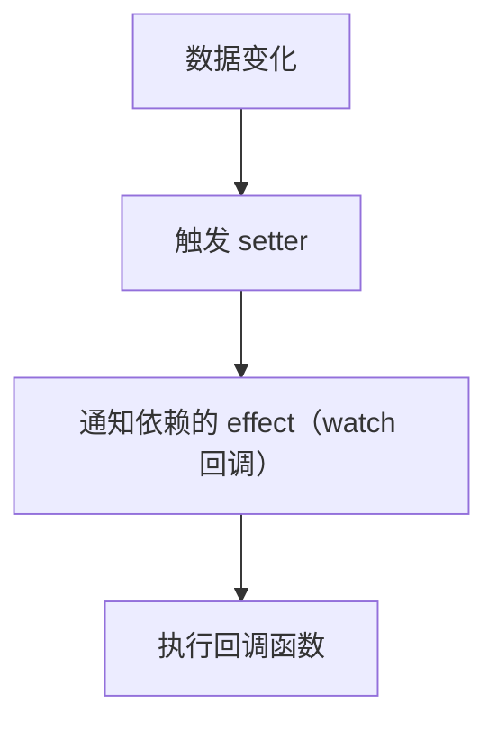
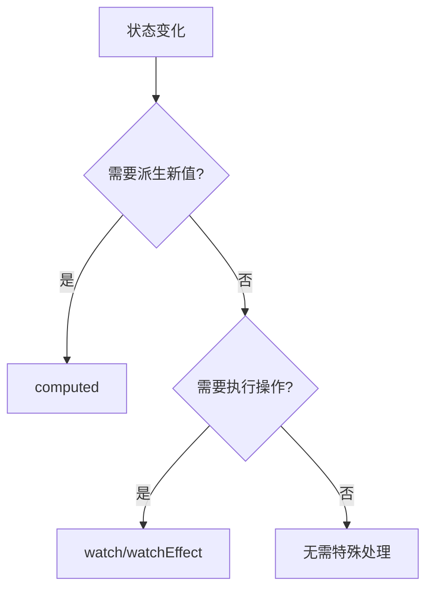
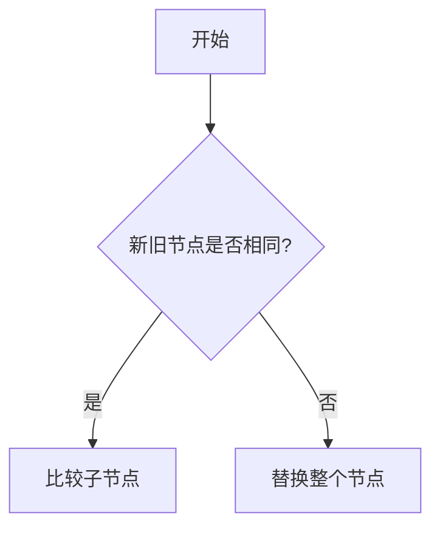

###  1. vue3 和 vue2 有什么区别

#### 1. 1组件选项 API 与组合式 API

在 Vue2 中使用的是 `Option` 选项式 API，将不同的功能分散到 `data()/methods/computed` 等选项中。

- 如果要使用 data 中定义的变量，需要使用 `this` 关键字
- 功能的分散导致代码难以维护，**深度依赖 `Mixins` 容易导致命名冲突**

在 Vue3 中使用的是 `Composition` 组合式API，

- 通过 `ref`声明响应式数据，通过 `reactive` 声明响应式对象
- 无需通过 `this` 关键字使用数据，通过 `.value` 使用 `ref` 数据，直接通过变量名使用 `reactive` 数据
- 使用 `setup()` 代替了 `created()/beforeCreate()` 生命周期钩子

> ##### 引申：为什么要 ref 需要使用 .value ？
>
> 因为 Vue3 使用 Proxy 实现响应式，而 **Proxy 无法代理基本数据类型**，因此在设计 ref 时进行了两层封装：
>
> - 将基本数据类型包装为 `{ value:xxx }` 的对象
> - 为该对象那个创建 Proxy 代理实现依赖收集和更新。

> 引申：vue3 为什么要采用 Composition API？
>
> 主要是为了**拆分开发的粒度**，在 **vue2 时我们开发的最小粒度是组件**，而在 vue3 通过 `Composition API` 将**最小开发粒度转变为了函数**。因此我们在组件与组件之间重复的**数据处理逻辑**可以通过抽离成 hooks 钩子函数的形式来代替 Minxins 混合造成的逻辑复杂的问题。

#### 1.2 响应式的设计不同

在 vue2 中是通过 **`Object.defineProperty()`** 实现响应式的，**无法检测对象属性的新增/删除和数组索引的修改**，我们需要通过 `Vue.set/Vue.delete` 等 API。

在 vue3 中是通过 **`Proxy`** 对象进行**数据劫持**来实现响应式的，支持**动态属性件监听**。

> 引申：为什么在使用 ref 时要通过 .value 的方式使用？
>
> 因为 `Javascript` 的 `Proxy` 无法直接代理基本类型，因此 Vue 在设计 ref 的时候就将ref 包装成为了 一个对象的形式通过 .value 属性的形式来触发 `getter/setter`，从而实现依赖收集和触发更新。
>
> reactive 同样是基于 Proxy 实现，所以能直接代理对象，不需要额外包装。但是 reactive 只能用于对象类型，这就解释了为什么 Vue 需要同时提供 ref 和 reactive 两种 API。

> 引申：Proxy 对象
>
> ```javascript
> /* target: 目标对象，待要使用 Proxy 包装的目标对象（ */
> /* handler: 一个通常以函数作为属性的对象，各属性中的函数分别定义了在执行各种操作时代理 proxy 的行为。 */ 
> const proxy = new Proxy(target, handler);
> 
> handler.has(target, propKey) -> in 操作符 的捕捉器 -- 截判断target对象是否含有属性propKey的操作
> handler.get(target, propKey, receiver) -> 属性读取操作的捕捉器 -- 拦截对象属性的读取
> handler.set(target,propKey, value,receiver) -> 属性设置操作的捕捉器 --  拦截对象的属性赋值操作
> handler.deleteProperty(target, propKey) -> delete 操作符的捕捉器 --  拦截删除target对象的propKey属性的操作
> ```
>
> 

#### 1.3 新增组件

`Teleport` 组件：将组件内容渲染到 DOM 外层的**指定位置**中

```vue
<button @click="open = true">Open Modal</button>

<!-- to 的值可以为 css 选择器也可以是 DOM 元素 -->
<!-- 下面的代码会被绑定到 body 元素中而不是当前组件 -->
<Teleport to="body">
  <div v-if="open" class="modal">
    <p>Hello from the modal!</p>
    <button @click="open = false">Close</button>
  </div>
</Teleport>
```

`Suspense` 组件：用于处理**异步组件**的加载状态

```vue
<Suspense>
  <!-- 具有深层异步依赖的组件 -->
  <Dashboard />
    
  <!-- <Suspense> 组件有两个插槽：#default 和 #fallback -->
  <!-- 在 #fallback 插槽中显示 “正在加载中” -->
  <template #fallback>
    Loading...
  </template>
</Suspense>
```

#### 1.4 性能优化

Vue3 新增了性能优化的处理方案，提高了渲染和更新的性能：

- **静态节点提升**：在编译阶段标记静态内容，从而跳过虚拟 DOM 的创建和对比
- **Patch Flags**：进行动态节点标记，将不同的内容进行区分标记，从而减少 diff 计算量

#### 1.5 Vue 生命周期

##### 1.5.1 初始化阶段

- `setup()`：`Composition API` 的入口，在组件实例创建前 `(beforecreate)`执行，**不能访问 `this`**
- `beforeCreate`：选项式 API ，**实例初始化**了但是 **data、methods** 等未初始化

- `created` ：选项式 API ，**data、methods** 等已经初始化，但**未挂载 DOM ，不能进行 DOM 操作**

##### 1.5.2 挂载阶段

- `onBeforeMount(组合式 API)/ beforeMount(选项式API)`：挂载开始前调用
- `onMounted(组合式 API)/ mounted(选项式API)`：**DOM 挂载完成，可进行 DOM操作**

##### 1.5.3 更新阶段

- `onBeforeUpdate (组合式 API)/ beforeUpdate(选项式API)`：数据变化导致DOM更新之前调用
- `onUpdated (组合式 API)/ updated(选项式API)`：**DOM更新完成**后调用

##### 1.5.4 销毁阶段

- `onBeforeUnmount(组合式 API)/ beforeUnmount(选项式API)`：组件卸载之前调用，**适合清理定时器、取消事件监听等**
- `onUnmounted(组合式 API)/unmounted(选项式API)`：组件卸载后调用

##### 1.5.6 生命周期最佳实践

- 推荐在  `onMounted、onBeforeMount ` 中获取**异步数据**，选项式 API 也可以在 `created` 中获取数据
- 在 `onUnmounted` 或 `onBeforeUnmount`中清理定时器、事件监听
- **避免在 `onUpdated` 修改状态，可能导致无限循环**

##### 1.5.7 生命周期执行顺序

- ##### **父子组件嵌套时的顺序**


```text
父 beforeCreate → 父 created → 父 beforeMount  
   → 子 beforeCreate → 子 created → 子 beforeMount → 子 mounted  
   → 父 mounted
```

- ##### **更新触发的顺序**


```text
父 beforeUpdate → 子 beforeUpdate → 子 updated → 父 updated
```

- ##### **销毁触发的顺序**


```text
父 beforeUnmount → 子 beforeUnmount → 子 unmounted → 父 unmounted
```

##### 1.5.8 keep-alive 对生命周期的影响

> `keep-alive` 是 `Vue` 提供的一个内置组件，用来**对组件进行缓存** -- 在组件切换过程中将状态**保留在内存中**，**防止重复渲染`DOM`**

如果为一个组件包裹了 `keep-alive`，那么它**会多出两个生命周期：`deactivated`、`activated`**。**同时`beforeDestroy` 和 `destroyed`  就不会再被触发了，因为组件不会被真正销毁。**

**当组件被换掉时，会被缓存到内存中、触发 `deactivated` 生命周期；当组件被切回来时，再去缓存里找这个组件、触发 `activated` 钩子函数。**


### 2. `<component :is>` 

- `<component :is>`是 vue 的**内置组件**，用于**==在运行时==**根据条件 **`:is`属性动态渲染不同组件**。
- **解决了“条件渲染多个组件导致代码冗长和逻辑复杂”的问题**。想象一下用多个 `v-if="currentTab === 'Home'"`、`v-if="currentTab === 'About'"`来切换内容，远不如一个简洁的 `<component :is="currentTabComponent">`

```vue
<template>
  <div>
    <button @click="tab = 'home'">Home</button>
    <button @click="tab = 'about'">About</button>
 
    <Home v-if="tab === 'home'" />
    <About v-if="tab === 'about'" />
  </div>
</template>

<!-- 等价于以下代码 -->
<template>
  <div>
    <button @click="tab = 'home'">Home</button>
    <button @click="tab = 'about'">About</button>
 
    <component :is="tab === 'home' ? Home : About" />
  </div>
</template>
 
<script setup>
import Home from './Home.vue'
import About from './About.vue'
</script>
```


### 3. $nextTick

`$nextTick(callback)` 用于在**下次 ==DOM 更新循环==结束之后执行延迟回调**。在修改数据之后立即使用这个方法，获取更新后的 DOM。

注意：==**我们应该始终先完成数据修改操作，然后在最后才调用 nextTick。**==

> **在 Vue 中更改响应式状态时，最终的 DOM 更新并==不是同步生效==的，而是由 Vue 将它们==缓存==在微任务队列中，直到下一个 "tick" 才一起执行**。

> 引申：面试如何回答 nextTick？
>
> 原因：在 vue 中**==视图更新是异步==**的而不是立即执行的，因此当响应式数据发生改变时**触发更新的 watcher会被推入一个异步更新队列**，当后续所有的同步代码都执行完毕以后，vue才会将一步更新队列中的 watcher 推入到任务队列中等待执行。
>
> 作用：`$nextTick` 会将传入的 `callback` 回调函数推入 `callbacks` 回调函数队列中，然后 vue 会将一个遍历该回调函数队列的 **`flushCallbacks`** 函数也推入到任务队列中。由于视图更新任务队列和回调函数任务队列先后被推入到任务队列中，当**==视图真正更新后就会执行通过 `$nextTick`注册的所有回调函数，从而访问到更新后的DOM状态==**。

```vue
<template>
  <button ref="counter" @click="increment">{{ count }}</button>
</template>

<script setup>
import { ref, nextTick } from 'vue'

const count = ref(0)
const counter = ref()
async function increment() {
  count.value++

  // DOM 还未更新
  console.log("响应式值:", count.value)
  console.log("DOM值:",document.getElementById('counter').textContent)
 
  await nextTick(()=>{
 // DOM 此时已经更新
  console.log("更新后的DOM值:",document.getElementById('counter').textContent) 
  })
}
</script>
```


### 4. v-model 双向绑定

`v-model` 是 vue 的一种**语法糖**用于实现数据的双向绑定，**在本质上相当于：属性绑定 + 事件监听**。

* 表单元素：**会根据表单元素的不同类型生成合适的属性和事件**
  * 普通文本框： **`:value` + `@input`**
  * 单选/多选框：**`:checked` + `@change`**


```vue
<input v-model=”message“>
<!-- 等价于 -->
<input :value=”message“ @input=”message = $event.target.value“>
```

* 自定义组件：**`:modelValue`  + `@update:modelValue` **

```vue
<ChildComponent v-model=”data“ />
<!-- 等价于 -->
<ChildComponent :modelValue=”data“ @update:modelValue=”newValue => data = newValue“ />
```

#### 4.1 v-model 修饰符

- `v-model.blur`：当失去焦点 `(blur)` 时才更新数据
- `v-model.number`：将输入内容自动转换为`number` 数字
- `v-model.trim`：去除输入内容前后的空白字符
- `v-model:lazy`：懒加载

#### 4.2 v-model 实现自定义组件

##### 4.2.1 绑定单个值

```vue
<!-- 父组件 -->
<template>
  <UserForm v-model="message" />
  <p>父组件接收的值：{{ message }}</p>
</template>

<script setup>
import { ref } from 'vue';
import UserForm from './UserForm.vue';

const message = ref('Hello');
</script>

<!-- 子组件 UserForm.vue -->
<template>
  <input
    :value="modelValue"
    @input=""$emit('update:modelValue', $event.target.value)"
  />
</template>

<script setup>
defineProps(['modelValue']);  // 接收父组件传递的值
defineEmits(['update:modelValue']);  // 定义更新事件
</script>
```

##### 4.2.2 绑定多个值

```vue
<!-- 父组件 -->
<template>
  <UserForm v-model:name="name" />
  <UserForm v-model:age="age" />
</template>

<script setup>
import { ref } from 'vue';
import UserForm from './UserForm.vue';

const name = ref('kiri');
const age = ref(18);   
</script>

<!-- 子组件 UserForm.vue -->
<template>
  <input :value="name" @input="$emit('update:name', $event.target.value)" />
  <input :value="age" @input="$emit('update:age', $event.target.value)" />
</template>

<script setup>
defineProps(['name', 'age']); // 接收父组件传递的值
defineEmits(['update:name', 'update:age']); // 定义更新事件
</script>
```


### 5.  Vue Router 路由

#### 5.1 Vue Router入门

` Vue Router` 是 `Vue.js` 官方提供的**路由管理器**，用于实现在**单页应用(SPA)**中切换页面而不刷新页面，下面是 ` Vue Router` 的基本使用和配置：

> Vue Router 模式具有 `history` 和 `hash` 两种不同的模式：
>
> - `hash`：**默认的路由模式**，可通过指定 `history: createWebHashHistory()` 启用
>   - URL格式：在URL中通过使用 **# 符号**来表示路由路径`https://example.com/#/user/profile`
>   - `#` 符号后面的内容被视为页面内的一个锚点，**路由的改变不会导致浏览器向服务器发送请求**，所有的路由改变都在**客户端进行**
> - `history`：需通过指定 `history: createWebHistory(process.env.BASE_URL)` 启用
>   - URL格式：URL中不包含 # 符号，采用常规的路径格式`https://example.com/user/profile`
>   - **路由的改变会导致浏览器向服务器发送请求**，需要服务器端的特殊配置支持，以确保所有路由的URL都**返回同一个HTML页面**
>
> | 模式            | 特点                    | 启用                                              | 示例                         |
> | --------------- | ----------------------- | ------------------------------------------------- | ---------------------------- |
> | **Hash模式**    | 使用URL hash模拟完整URL | `history: createWebHashHistory()`                 | `http://example.com/#/about` |
> | **History模式** | 使用HTML5 History API   | `history: createWebHistory(process.env.BASE_URL)` | `http://example.com/about`   |

```javascript
// router/index.js 配置
import { createRouter, createWebHistory } from 'vue-router'

// 路由配置，配置路由路径与组件的对应关系
const routes = [        
  {
    path: '/home',
    name: 'Home',
    component: () => import('../views/Home.vue')
  },
  {
    path: '/dashboard',
    name: 'Dashboard',
    component: DashboardLayout,
    // childre 子路由，子路由中的 path 不加 '/'
    children: [
      {
        // 注意这里没有斜杠 `/profile`，表示是 `/dashboard/profile`
        path: 'profile', 
        component: Profile
      },
      {
        path: 'settings',
        component: Settings
      }
    ]
  }
]
 
 //新建路由实例
const router = createRouter({
  // 指定使用 history 模式
  history: createWebHistory(process.env.BASE_URL),  
  routes
})
 
// 导出路由实例，在main.js中导入使用
export default router 

----------------------------------------------------------------------------------------

// main.js 配置
import { createApp } from 'vue'
import App from './App.vue'
import router from './router';

const app = createApp(App);
// 使用 router
app.use(router);
app.mount('#app');
```

#### 5.2 router-link

`router-link` 是 `Vue Router` 提供的一个组件，用于**实现路由跳转**。通过 `router-link` 组件，我们可以将某个**链接或者按钮转换成一个具有路由功能的链接**，具备以下属性：

- **`to`**：目标路由地址，将会跳转到该路由地址
- `replace`：是否应该调用 `router.replace()` 方法进行路由跳转

> 注意：`router.push`会向历史记录**添加新纪录并跳转**，`router.replace`**替换当前历史记录并跳转**

- `active-class`：指定链接激活时使用哪个 `class` 类名
- `append`：是否在当前路径后添加 `to` 指定的路由地址

```vue
<template>
  <div>
    <h1>首页</h1>
    <ul>
      <li>
        <router-link to="/">首页</router-link>
      </li>
      <li>
        <router-link to="/about">关于我们</router-link>
      </li>
      <li>
        <router-link to="/contact">联系我们</router-link>
      </li>
    </ul>
    <router-view></router-view>
  </div>
</template>

```

#### 5.3 router-view

`< router-view >` 是 `Vue Router` 中用于**渲染匹配路由组件**的组件。当一个路由被匹配时，它的组件将会渲染在 `< router-view >` 中

```vue
<!-- App.vue -->
<template>
  <div id="app">
    <header>
      <router-link to="/">Home</router-link>
      <router-link to="/about">About</router-link>
    </header>
	<!-- Home 页面 和 ABout 页面将在 <router-view> 中渲染 -->
    <router-view></router-view>
  </div>
</template>

<!-------------------------------------------------------------------------------------->

<!-- 指定多个不同的路由出口 -->
const routes = [
  {
    path: '/',
    components: {
      default: HomeView, // 默认出口 <router-view>
      sidebar: SidebarView, // <router-view name="sidebar">
      footer: AppFooter  // <router-view name="footer">
    }
  }
]
```

#### 5.4 动态路由

动态路由指的是**根据不同的参数值**，为**同一组件**创建多个路由，实现在同一组件中根据参数值展示不同的内容。

```javascript
const router = new VueRouter({
  routes: [
    {
      // 将根据传入的不同 id，在 User 组件渲染不同的用户信息
      path: '/users/:id',
      component: User
    }
  ]
})

----------------------------------------------------------------------------------------

// 组件中获取路由参数
import { useRoute } from 'vue-router'
const route = useRoute()
console.log(route.params.id)
```

##### 动态路由 API：

- 添加路由 `addRoute`

```javascript
// 添加路由
router.addRoute({
  path: '/new-route',
  name: 'newRoute',
  component: () => import('../views/NewView.vue')
})

// 添加为已有路由的子路由
router.addRoute('parentRoute', {
  path: 'child',
  component: () => import('../views/ChildView.vue')
})
```

- 删除路由 `deleteRoute`

```javascript
// 通过路由名称删除路由
router.removeRoute('routeName')

// 通过 addRoute 返回的回调删除路由
const removeRoute = router.addRoute(routeConfig)
removeRoute() // 删除路由
```

- 检查路由 `hasRoute`

```javascript
// 检查路由是否存在
router.hasRoute('routeName')

// 获取所有路由记录
router.getRoutes()
```

#### 5.5 路由守卫

##### 5.5.1 全局前置守卫 `beforeEach`

全局前置守卫是在**路由切换前执行**的钩子函数，在初始化时执行一次，然后在**每一次路由切换前都会被调用**，常用于实现权限控制。`beforeEach`回调具有三个参数：

- `to`：路由对象，表示要跳转到的目标路由

- `from`：路由对象，表示从哪个路由跳转而来
- `next`：函数，**调用该函数表示放行**，可以继续向下执行

```javascript
// 创建路由器对象
const router = new VueRouter({ ... });

// 全局前置守卫
router.beforeEach((to, from, next) => {
  // 判断是否需要鉴权
  if (to.meta.isAuth) {
    // 验证用户权限
    if (localStorage.getItem('token')) {
      next(); // 放行
    } else {
      alert('对不起，你没有权限访问该页面');
      next('/login'); // 重定向到登录页面
    }
  } else {
    next(); // 不需要鉴权，直接放行
  }
});

```

##### 5.5.2  全局解析守卫 `beforeResolve`

全局解析守卫在**全局前置守卫之后执行**，用于在**导航被确认之前、所有组件内守卫和异步路由组件被解析之后**进行操作

```javascript
router.beforeResolve((to, from, next) => {
  console.log('全局解析守卫', to, from)
  next()
});
```

##### 5.5.3 全局后置守卫 `afterEach`

全局后置守卫是在**路由切换完成后执行**的钩子函数，可以用于页面标题切换等

```javascript
// 全局后置守卫
router.afterEach((to, from) => {
  // 切换页面标题
  document.title = to.meta.title || '欢迎使用';
});
```

#### 5.6 滚动行为 scrollBehavior

> **注意：`scrollBehavior` 只在 `history` 模式中生效！！**

`scrollBehavior` 配置项说明：

- `to` ：要跳转到的路由对象
- `from`：从哪个路由对象跳转
- `savedPosition` ：是否当且仅当 `popstate` 导航 (通过浏览器的 前进/后退 按钮触发) 时才可用
-  `@return { ... }` ：返回滚动位置的对象信息，如 `{ x: number, y: number }`
- `falsy` ：若返回一个 `falsy `或者是一个空对象，那么不会发生滚动

> 拓展：`falsy` 是在**布尔上下文**中认定为 **false** 的值，下图包含 `JavaScript` 的所有假值：
>
> | 值             | 类型        | 描述                                                         |
> | :------------- | :---------- | :----------------------------------------------------------- |
> | `null`         | `Null`      | 关键词 `null` — 任何值的缺失                                 |
> | `undefined`    | `Undefined` | `undefined`— 原始类型值                                      |
> | `false`        | `Boolean`   | `false`                                                      |
> | `NaN`          | `Number`    | `NaN` — 不是一个数字                                         |
> | `0`            | `Number`    | `Number` 零，也包括 `0.0`、`0x0` 等。                        |
> | `-0`           | `Number`    | `Number`负的零，也包括 `-0.0`、`-0x0` 等。                   |
> | `0n`           | `BigInt`    | `BigInt` 零，也包括 `0x0n` 等。需要注意没有`BigInt` 负的零 —— `0n` 的相反数还是 `0n`。 |
> | `""`           | `String`    | 空字符串值，也包括 `''` 和 ````。                            |
> | `document.all` | `Object`    | 唯一具有假值的 JavaScript 对象是内置的`document.all`         |

##### 5.6.1 基本使用

```javascript
// demo1
scrollBehavior (to, from, savedPosition) {
  // 对于所有路由导航，简单地让页面滚动到顶部。  
  return { x: 0, y: 0 } 
}

// demo2
scrollBehavior (to, from, savedPosition) {
    if (savedPosition) {
    // 返回 savedPosition，在按下 后退/前进 按钮时，就会像浏览器的原生表现那样。    
    return savedPosition 
  } else {
    return { x: 0, y: 0 }
  }
}

// demo3
scrollBehavior (to, from, savedPosition) {
  if (to.hash) {
    return {
      // 利用路由元信息更细颗粒度地控制滚动 router.push({ hash: '#comments' })  
      el: to.hash,
      behavior: 'smooth' // 平滑滚动
    }
  }
}
```

##### 5.6.2 异步延迟滚动

```javascript
const router = createRouter({
  scrollBehavior(to, from, savedPosition) {
    return new Promise((resolve, reject) => {
      setTimeout(() => {
        resolve({ left: 0, top: 0 })
      }, 500)
    })
  },
})
```

#### 5. 7 完整示例

```javascript
// router/index.js
import { createRouter, createWebHistory } from 'vue-router'
import { useAuthStore } from '@/stores/auth'
import NProgress from 'nprogress'

const routes = [
  {
    path: '/',
    name: 'home',
    component: () => import('@/views/HomeView.vue'),
    meta: {
      title: '首页',
      requiresAuth: false,
      cache: true
    }
  },
  {
    path: '/login',
    name: 'login',
    component: () => import('@/views/LoginView.vue'),
    meta: {
      title: '登录',
      guestOnly: true
    }
  },
  {
    path: '/dashboard',
    name: 'dashboard',
    component: () => import('@/views/DashboardView.vue'),
    meta: {
      title: '仪表盘',
      requiresAuth: true
    }
  },
  {
    path: '/admin',
    name: 'admin',
    component: () => import('@/views/layouts/AdminLayout.vue'),
    meta: {
      title: '管理后台',
      requiresAuth: true,
      roles: ['admin']
    },
    children: [
      {
        path: '',
        name: 'admin-dashboard',
        component: () => import('@/views/admin/DashboardView.vue'),
        meta: { title: '控制台' }
      },
      {
        path: 'users',
        name: 'admin-users',
        component: () => import('@/views/admin/UsersView.vue'),
        meta: { title: '用户管理' }
      }
    ]
  },
  {
    path: '/:pathMatch(.*)*',
    name: 'not-found',
    component: () => import('@/views/NotFoundView.vue'),
    meta: {
      title: '页面不存在'
    }
  }
]

const router = createRouter({
  history: createWebHistory(import.meta.env.BASE_URL),
  routes,
  scrollBehavior(to, from, savedPosition) {
    if (savedPosition) return savedPosition
    if (to.hash) return { el: to.hash, behavior: 'smooth' }
    return { top: 0 }
  }
})

// 进度条配置
NProgress.configure({ showSpinner: false })

// 全局前置守卫
router.beforeEach(async (to, from, next) => {
  NProgress.start()
  
  const authStore = useAuthStore()
  const isAuthenticated = authStore.isAuthenticated
  const userRole = authStore.user?.role || 'guest'
  
  // 设置页面标题
  document.title = to.meta.title ? `${to.meta.title} | 我的应用` : '我的应用'
  
  // 检查认证
  if (to.meta.requiresAuth && !isAuthenticated) {
    return next({
      name: 'login',
      query: { redirect: to.fullPath }
    })
  }
  
  // 检查角色权限
  if (to.meta.roles && !to.meta.roles.includes(userRole)) {
    return next({ name: 'forbidden' })
  }
  
  // 已登录用户访问guestOnly路由
  if (to.meta.guestOnly && isAuthenticated) {
    return next({ name: 'home' })
  }
  
  next()
})

// 全局后置钩子
router.afterEach(() => {
  NProgress.done()
})

export default router
```


### 6. Pinia 状态管理

#### 6.1 `Pinia` 和 `vuex` 的区别

- **API 设计的差异**

  - 在 vuex 中我们需要通过 `mutations`来进行同步修改，通过 `actions` 提交异步操作

  - 在 PInia 中取消了 `mutations`，直接通过 actions 进行同步/异步操作。

    > 在 Composition API 时：
    >
    > - `ref()` 就是 `state` 属性
    > - `computed()` 就是 `getters`
    > - `function()` 就是 `actions`

- **模块化差异**
  - 在 `vuex` 中我们需要通过 `modules` 了划分模块，通过 `namespaced` 隔离不同的模块
  - 在 `Pinia` 中每个 `Store` 就是一个独立的模块，支持动态加载组合

- **TypeScript支持**
  - vuex 是 vue2 的状态管理工具，对 TypeScript 的支持较弱，需要手动声明类型，类型推导不够直观
  - Pinia 是 vue3 的状态管理工具，原生支持 TypeScript，能自动推导类型

#### 6.2 `Pinia` 基本使用

`pinia` 是 `vue3` 的专属状态管理库，用于替代 `vuex` 实现组件间的**状态共享**

##### Q：为什么要使用 Pinia/vuex？

- **保存状态**

- **解决“状态分散”带来的混乱和不可预测性**：避免触发层层嵌套组件的更新
- **分离业务逻辑与视图逻辑**：**业务逻辑迁移到 Store，组件专注于渲染视图、分发用户操作等**，**提升可维护性和可测试性**
- 可通过 `Vue DevTools` 捕获每一个**状态变更的精确时刻**

```javascript
// App.vue
import { createApp } from 'vue'
import { createPinia } from 'pinia'
import App from './App.vue'

const pinia = createPinia()
const app = createApp(App)

app.use(pinia)
app.mount('#app')

----------------------------------------------------------------------------------------

// store/counter.js
export const useCounterStore = defineStore('counter', () => {
  const count = ref(0)
  const doubleCount = computed(() => count.value * 2)
  function increment() {
    count.value++
  }

  return { count, doubleCount, increment }
})

// 组件使用 Store
<script setup>
// 导入 Store
import { useCounterStore } from '@/stores/counter'
// 初始化声明 Store
const store = useCounterStore()
</script>
```

> 注意：**我们不能直接对 store 解构数据(会破坏响应性)，需要使用 `storeToRefs` 对 store 进行解构。而 `actions` 可以直接解构。**

```javascript
import { storeToRefs } from 'pinia'
const store = useCounterStore()
// 并且会跳过所有的 action 或非响应式 (不是 ref 或 reactive) 的属性
const { name, doubleCount } = storeToRefs(store)
// 作为 action 的 increment 可以直接解构
const { increment } = store
```

#### 6.3 Pinia 状态持久化

##### 6.3.1 基本使用

`Pinia` 本身是不支持状态持久化的，我们需要通过安装 `pinia-plugin-persistedstate` 插件来实现状态持久化。

```javascript
// 安装插件
npm install pinia-plugin-persistedstate

// 使用插件
import { createPinia } from 'pinia'
import piniaPluginPersistedstate from 'pinia-plugin-persistedstate'
const pinia = createPinia()
pinia.use(piniaPluginPersistedstate)
app.use(pinia)

// 开启持久化

export const useStoreState = defineStore('store', 
    () => {
        const name = ref('张三');
        return {name}
    },
    {
        persist: true //开启
    	persist: { enabled: false} // 禁用
    }
)
```

##### 6.3.2 `persist` 持久化配置

- **`enabled`**：是否启用持久化
- **`storage`**：指定要持久化的存储位置，**默认为 sessionStorage **
- **`key`**：指定存储时的键名
- **`paths`**：指定要持久化的字段，不指定则默认全部
- **`strategies`**：支持配置多个不同的持久化策略

```javascript
{
	persist: {
        // 启用持久化
        enabled: true，
		strategies: [
    		{
        	// 指定本地存储的 key 为 store_key
      		key: 'store_key',
        	// 存储位置：localStorage / sessionStorage
      		storage: localStorage, 
        	// 只存储 token 和 userinfo 字段
      		paths: ['token', 'userInfo']
    		}
  		]
    } 
}
```


### 7. computed 和 watch

#### 7.1 computed 计算属性

##### 7.1.1 底层原理：依赖追踪

* **依赖收集**：当你在 `computed` 的 `getter` 中访问响应式数据如 `ref` 或 `reactive`时，`Vue` 会**自动追踪这些依赖**。
* **缓存机制**：**只有当依赖项变化并且==访问时==，`computed` 才会重新计算**，否则直接**返回缓存值**。
* 懒计算：如果没有任何地方使用这个 `computed` 值，它的 `getter` 不会执行。

##### 7.1.2 何时使用 setter？

当需要手动修改 computed 值时，必须定义 setter，并在其中更新依赖项。

```javascript
示例：拆分用户输入的全名到姓和名。
const fullName = computed({
  get() { return firstName.value + ’ ‘ + lastName.value; },
  set(value) {
    const parts = value.split(’ ‘);
    firstName.value = parts[0];
    lastName.value = parts[1] || ’‘;
  }
});
```

##### ==7.1.3 如何理解 computed 缓存？==

- `computed` 是**响应式**的
  - 读取 `computed` 时会触发 `get`
  - 设置 `computed` 时会触发 `set`
- **`computed` 依赖于 `watcher` 的 `dirty` 属性**：
  - `dirty` 为 `true` 则读取 `computed` 会重新计算
  - `dirty` 为 `false` 则读取 `computed` 会使用缓存
- 计算属性 C 依赖于 A，则`computed` 更新过程：
  - 数据 A 收集 C 的 `watcher` 和当前页面的 `watcher`
  - 当 A 发生改变时，会将 C 的 `watcher` 中的 `dirty` 设置为 `true`
  - 同时，A 会通知页面进行更新，此时页面会重新读取计算属性 C，此时 `dirty:true` 因此计算属性 C 会重新更新
  - 计算属性 C 更新完后重新将 `dirty` 设置为 `false` ，如果 A 不在发生变化，则下次会读取缓存

#####  7.1.4 computed 是如何进行依赖收集的？


#### 7.2 watch 侦听器

##### 7.2.1 核心作用：监听**响应式数据**的变化，并在==变化时执行==指定的回调函数



##### 7.2.2 基础语法

```js
import { watch } from ’vue‘;
watch(source, callback, options);
```

* source：要监听的数据（ref/reactive/函数/数组）
* callback：变化时触发的回调函数
* options：配置对象（deep/immediate/flush 等）

##### 7.2.3 基础用法：监听不同数据源

- 监听单个 ref

```js
const count = ref(0);

// 当 count 变化时触发回调
watch(count, (newValue, oldValue) => {
  console.log(`count 从 ${oldValue} 变为 ${newValue}`);
});

count.value++; // 触发回调：输出 ”count 从 0 变为 1“
```

- 监听 `reactive` 对象的属性

```js
const state = reactive({ name: ’Alice‘, age: 25 });

// 监听 state.age
watch(
  () => state.age,
  (newAge, oldAge) => {
    console.log(`年龄从 ${oldAge} 变为 ${newAge}`);
  }
);

state.age++; // 触发回调：输出 ”年龄从 25 变为 26“
```

- 监听多个数据源：接收一个数组对象作为监听源

```js
const name = ref(’Alice‘);
const age = ref(25);

// 同时监听 name 和 age
watch([name, age], ([newName, newAge], [oldName, oldAge]) => {
  console.log(`姓名从 ${oldName} 变为 ${newName}`);
  console.log(`年龄从 ${oldAge} 变为 ${newAge}`);
});

name.value = ’Bob‘; // 触发回调
age.value = 30;     // 再次触发回调
```

##### 7.2.4 高级配置选项

- `immediate: true` - 立即执行

```js
watch(
  count,
  (newValue) => {
    console.log(’初始值:‘, newValue); // 立即执行一次
  },
  { immediate: true }
);
```

- `deep: true` - 深度监听（针对对象/数组）

```js
const state = reactive({
  user: { name: ’Alice‘ }
});

watch(
  () => state.user,
  (newUser) => {
    console.log(’user 变化:‘, newUser);
  },
  { deep: true } // 深度监听对象内部变化
);

state.user.name = ’Bob‘; // 触发回调

```

- `flush: 'post'` - 控制回调执行时机

```js
watch(
  count,
  () => {
    // DOM 更新后执行
    console.log(’DOM 已更新‘, document.getElementById(’counter‘).textContent);
  },
  { flush: ’post‘ } // 可选值：’pre‘ | ’post‘ | ’sync‘
);

```

#### 7.3 watch与computed的区别

| 特性     | `watch`                        | `computed`                             |
| -------- | ------------------------------ | -------------------------------------- |
| 返回值   | 无                             | 返回计算后的值                         |
| 缓存     | 无缓存，每次变化都执行         | 自动缓存依赖未变的结果                 |
| 异步支持 | 支持（如网络请求）             | 不支持                                 |
| 使用场景 | 副作用操作（如请求、DOM 操作） | 派生新的响应式数据                     |
| 执行时机 | 默认在依赖==变化后执行==       | 在==访问时计算==（依赖变化后延迟计算） |




### 8. 组件通信

#### 8.1 父子通信

##### ==8.1.1 父传子 props + emits==

父组件传递数据给子组件，子组件触发事件通知父组件

```vue
<!-- 父组件 -->
<template>
  <!-- 通过 :message 传递值给子组件，通过 @update 绑定触发事件为 handleUpdate -->
  <Child :message="parentMsg" @update="handleUpdate"/>
</template>
<script setup>
import { ref } from 'vue'
import Child from './Child.vue'

const parentMsg = ref('Hello from Parent')
const handleUpdate = (newMsg) => {
  <!-- parent.value 被赋值为子组件传递的参数 'Hello from Child' -->
  parentMsg.value = newMsg
}
</script>

-----------------------------------------------------------------------------------------

<!-- 子组件 -->
<template>
  <div>{{ message }} <button @click="sendMessage">Send</button></div>
</template>
<script setup>
import { defineProps, defineEmits } from 'vue'

<!-- 通过 defineProps 暴露 message 属性接收父组件传值 -->
const props = defineProps({
  message: String
})
<!-- 通过 defineEmits 声明 update 事件 -->
const emit = defineEmits(['update'])

const sendMessage = () => {
  <!-- 点击按钮时触发 'update' 事件，并传递参数 'Hello from Child' -->  
  emit('update', 'Hello from Child')
}
</script>
```

##### 8.1.2 子传父 `defineExpose + ref`

```vue
<!-- 子组件 -->
<template>
  <div>Child Component</div>
</template>
<script setup>
import { defineExpose } from 'vue'

const publicMethod = () => {
  console.log('Child method called')
}
// 暴露 publicMethod 给父组件使用
defineExpose({ publicMethod })
</script>

-----------------------------------------------------------------------------------------

<!-- 父组件 -->
<template>
  <Child ref="childRef" />
  <button @click="callChildMethod">Call Child</button>
</template>
<script setup>
import { ref } from 'vue'
import Child from './Child.vue'

// 通过 ref 获取子组件 Child
const childRef = ref(null)
const callChildMethod = () => {
   // 获取子组件暴露的 publicMethod 方法并调用
  childRef.value.publicMethod()
}
</script>
```

##### 8.1.4 双向通信 `v-model`

用于父组件与子组件之间的**双向数据同步**

```vue
<!-- 父组件 -->
<template>
  <Child v-model="value" />
</template>
<script setup>
import { ref } from 'vue'
import Child from './Child.vue'

const value = ref('Initial Value')
</script>

-----------------------------------------------------------------------------------------

<!-- 子组件 -->
<template>
  <!-- 子组件通过 :value 双向绑定值，并通过 @input 事件来更新内容 -->
  <input :value="modelValue" @input="updateValue($event.target.value)" />
</template>
<script setup>
import { defineProps, defineEmits } from 'vue'

// 通过 defineProps 接收值，通过 defineEmits 触发值更新
const props = defineProps(['modelValue'])
const emit = defineEmits(['update:modelValue'])

const updateValue = (val) => {
  emit('update:modelValue', val)
}
</script>
```

##### 8.1.5 使用 `attribute` 透层

没有被子组件声明的 `props` 和 `emits` 的属性会被子元素自动添加到根元素上，根元素可通过 `useAttrs()` 获取 `attribute` 属性， 通过 `defineOptions({inheritAttrs: false})` 禁止添加到根元素上

```javascript
// 父组件
<template>
  <Child data-a="a" />
</template>

-----------------------------------------------------------------------------------------

<!-- 子组件 -->
<template>
  <input :value="modelValue" @input="updateValue($event.target.value)" />
</template>

<script setup>
import { useAttrs } from 'vue'
const attrs = useAttrs() 
</script>
```

#### 8.2 跨组件通信

##### 8.2.1 通过事件总线 Mitt

```javascript
// emitter.js 定义事件总线
import mitt from 'mitt'
export const emitter = mitt()

-----------------------------------------------------------------------------------------
      
// 兄弟组件 A
<script setup>
import { emitter } from './emitter'
// 通过 emitter.on 接收 notify 内容
emitter.on('notify', (data) => {
  console.log('BrotherA收到消息：', data)
})
</script>

-----------------------------------------------------------------------------------------
    
// 兄弟组件 B
<script setup>
import { emitter } from './emitter'
setTimeout(() => {
  // 通过 emitter.emit 传递内容 notify
  emitter.emit('notify', { msg: 'Hello BrotherA' })
}, 1000)
</script>
```

##### 8.2.2  共享父组件状态 `$parent`

```javascript
// 父组件
<template>
  <BrotherA :shared="state" />
  <BrotherB :shared="state" />
</template>
<script setup>
import { reactive } from 'vue'
import BrotherA from './BrotherA.vue'
import BrotherB from './BrotherB.vue'

const state = reactive({ count: 0 })
</script>

-----------------------------------------------------------------------------------------
    
// 兄弟组件
<template>
  <button @click="increment">Increment</button>
</template>
<script setup>
import { defineProps } from 'vue'

const props = defineProps({
  shared: Object
})
function increment() {
  props.shared.count++
}
</script>
```

#### 8.3 跨层组件通信

##### 8.3.1 祖孙组件通信  `Provide + Inject`

祖先组件向后代组件**直接传递数据**，无需逐层传递

```vue
<!-- 祖先组件 -->
<template>
  <GrandChild />
</template>
<script setup>
import { provide, ref } from 'vue'
import GrandChild from './GrandChild.vue'

const theme = ref('dark')
// 通过 provide 将 theme 值绑定到键 theme 上 ['theme', theme] 并暴露出去
provide('theme', theme)
</script>

-----------------------------------------------------------------------------------------

<!-- 孙组件（隔代组件） -->
<template>
  <div>Theme: {{ theme }}</div>
</template>
<script setup>
import { inject } from 'vue'

// 通过 inject 接收键为 theme 的值并赋值给 theme
const theme = inject('theme')
</script>
```

#### 8.4 通过 `Pinia/vuex` 共享状态


### 9.  自定义指令

#### 9.1 自定义指令生命周期

自定义指令的生命周期**与组件生命周期类似**

- `created`：在绑定元素的 `attribute` 前或事件监听器应用前调用
- `beforeMount`：第一次绑定到元素且被插入到 DOM 前调用
- `mounted`：在绑定元素的父组件及他自己的所有子节点都挂载完成后调用，大部分自定义指令都使用这个钩子来编写指令实现逻辑
- `beforeUpdate`：绑定元素的父组件更新前调用
- `updated`：在绑定元素的父组件及他自己的所有子节点都更新后调用
- `beforeUnmount`：绑定元素的父组件卸载前调用
- `unmounted`：绑定元素的父组件卸载后调用

#### 9.2 自定义指令参数

每个指令的钩子函数的参数都是一致的，包含四个参数：

- **`el`：指令绑定到的元素，用于直接操作 DOM( 谁使用自定义指令，el 就指向谁 )**
- **`binding`**：对象，**用于获取传递给自定义指令的信息**，包含以下属性：
  - **`value`**：**等号后面传递的 `JavaScript` 表达式的值，例如在  `v-my-directive=“1 + 1”` 中，值是 2**
  - `oldValue`：之前的值，仅在 `beforeUpdate` 和 `updated` 中可用。无论值是否更改，它都可用
  - **`arg`：指令名**后面紧跟的**冒号 `:`后面的部分**，例如在 `v-my-directive:foo` 中，参数是 `“foo”`**
  - `modifiers`：一个包含修饰符的对象 (如果有的话)。例如在 `v-my-directive.foo.bar` 中，修饰符对象是 `{ foo: true, bar: true }`
  - `instance`：使用该指令的组件实例
  - `dir`：指令的定义对象
- `vnode`：代表绑定元素的底层 `VNode`
- `prevVnode`：代表之前的渲染中指令所绑定元素的 `VNode`。仅在 `beforeUpdate` 和 `updated` 钩子中可用

#### 9.3 自定义指令的实现

##### 9.3.1 通过 ref 实现

```javascript
<input type="text" ref="inputRef" />

const inputRef = ref(null)
inputRef.value.focus()
```

##### 9.3.2 局部注册 -- 组件内通过 `directives` 注册，只在组件内部使用

```javascript
<input type="text" v-focus />

import { Directive } from 'vue'
const vFocus: Directive = {
	mounted(el, binding, vnode, prevVnode) {
    	el.focus()
  	},
}

```

##### 9.3.3 全局注册 -- main.js 注册，全局可用

```javascript
app.directive('focus', {
	mounted(el, binding, vnode, prevVnode) {
    	el.focus()
  	},
})
```

##### 9.3.4 在 directives 中统一注册

在 `directives` 文件夹创建 `index.ts` 用于统一注册自定义指令

```javascript
import { App } from 'vue'
import drag from './drag'

// 用于接收所有的自定义指令
const directives: any = {
  drag
}

// 统一注册自定义指令并导出
export default (app: App<Element>) => {
  Object.keys(directives).forEach((key: any) => {
    app.directive(key, directives[key])
  })
}
```

在 `directives` 文件夹下创建 `drag.ts` 实现自定义拖拽指令 `v-drag`：

```javascript
import { Directive, DirectiveBinding } from 'vue'

const drag: Directive<any, void> = (
  el: HTMLElement,
  bingding: DirectiveBinding
) => {
  // console.log('el', el) // 这个 el 就是挂载 v-drag 指定的元素
  const right = window.innerWidth - el.clientWidth
  const bottom = window.innerHeight - el.clientHeight

  // 获取内部第一个div元素
  let moveElement: HTMLDivElement = el.firstElementChild as HTMLDivElement
  moveElement.style.cursor = 'move'
  // 鼠标按下的事件
  const mouseDown = (e: MouseEvent) => {
    let X = e.clientX - el.offsetLeft
    let Y = e.clientY - el.offsetTop

    // 鼠标移动事件
    const move = (e: MouseEvent) => {
      // 控制向左移动最左不能超出窗口左侧 且 向右移动最右不能让盒子超出窗口右侧
      let moveX =
        el.offsetLeft < 0 ? 0 : e.clientX - X > right ? right : e.clientX - X
      // 控制向上移动最上不能超出窗口顶部 且 向下移动最下不能让盒子超出窗口底部
      let moveY =
        e.clientY - Y < 0 ? 0 : e.clientY - Y > bottom ? bottom : e.clientY - Y

      el.style.left = moveX + 'px'
      el.style.top = moveY + 'px'
    }
    document.addEventListener('mousemove', move)
    // 在鼠标抬起时去移除移动事件
    document.addEventListener('mouseup', () => {
      // 移除移动事件
      document.removeEventListener('mousemove', move)
    })
  }
  // 为获取到的div盒子绑定鼠标按下事件
  moveElement.addEventListener('mousedown', mouseDown)
}

export default drag
```


### 10. 虚拟 DOM 和 Diff 算法

#### 10.1 什么是虚拟 DOM

虚拟DOM是真实DOM的轻量级 **`JavaScript` 对象表示**，它**通过 `JavaScript` 对象树描述真实DOM的结构和属性**

在 `vue` 中**每个组件都会有一个 `render` 函数，每个 `render` 都会返回一个虚拟 `dom` 树**，这意味着每个组件都对应一个虚拟 `dom` 树


```javascript
// 真实 DOM
<div class=”container“>
  <h1>Hello World</h1>
  <p @click="handleClick">Click me</p>
</div>

// 虚拟 DOM
const vNode = {
  // 标签为 div
  tag: 'div',
  // 该 div 包含一个类型为 container
  props: { className: 'container' },
  // 该 div 元素的子元素
  children: [
    // 包含一个子元素 h1 标签, 内容为 'Hello World'
    { tag: 'h1', children: 'Hello World' },
    // 包含一个子元素 p 标签,包含一个点击事件 handleClick，内容为 'Click me'
    { tag: 'p', props: { onClick: handleClick }, children: 'Click me' }
  ]
};
```

#### 10.2 为什么需要虚拟DOM

- **直接操作DOM代价高昂**：在 `vue` 中**每次渲染视图都会调用 `render` 函数**，如果直接进行 DOM 操作会涉及浏览器**重绘和回流**，频繁更新会导致性能瓶颈**极大降低渲染效率** 
- **虚拟DOM作为缓冲层**：通过**对比新旧虚拟DOM树的差异**（Diff算法）**，批量更新真实DOM**，减少直接操作次数，从而**降低回流的频率**

> ##### 虚拟 DOM 一定比真实 DOM 快吗？
>
> * 不一定：在简单场景下如直接替换整个 DOM，虚拟 DOM 反而更慢。
> * 优势场景：复杂 **UI 的频繁更新**，虚拟 DOM 能通过 Diff 和批量更新优化性能。

#### 10.3 模板和虚拟 DOM 的关系

vue 中有一个 `complie` 模块负责将模板转换为 `render` 函数，而 `render` 函数调用后将得到虚拟 `DOM`。编译的过程分为两步：

- 将模板字符串转换为 AST 抽象语法树
- 将 AST 转换为 `render` 函数

**`vue` 最终运行时需要的实时 render 函数而不是模板 `template`，`template` 中的各种语法都会转换为虚拟 dom 的配置。**

#### 10.4 Diff 算法

**核心：比较新旧虚拟DOM树的差异，找出==最小化的更新操作==，应用到真实DOM**

##### 10.3.1 Diff 算法核心

- **生成虚拟`DOM`树**：初次渲染时创建虚拟DOM
- **数据变化时生成新虚拟树**：状态更新触发新树生成
- **`Diff` 比较新旧树**：
  - **根节点类型不同**直接替换整棵树
  - **根节点类型相同**则**递归对比属性和子节点**



- **生成补丁`Patch`**：记录差异，如更新属性、插入节点
- **批量更新真实DOM**：将补丁应用到真实DOM

##### 10.3.2 vue 的 Diff 算法优化

- **同层级进行比较**，不支持跨层比较

- **静态标记`Patch Flags`**：**==编译时==**标记动态节点属性如`class`或`v-model`，**静态节点提升**，`Diff` 时**仅处理标记部分，跳过静态内容**
- **双端比较**：**头对头、尾对尾、头对尾、尾对头**四种匹配方式
  - 旧头 vs 新头（比较是否相同）:旧列表头部节点相同（如列表顺序未变），直接复用旧节点，移动新旧头指针向右。
  - 旧尾 vs 新尾（比较是否相同）:新旧列表尾部节点相同（列表末尾新增节点），直接复用旧节点，移动新旧尾指针向左。
  - 旧头 vs 新尾（交叉比较）:旧头节点出现在新列表尾部（如列表反转）。将旧头节点移动到旧尾节点的下一个位置（即新尾的位置），移动旧头指针向右，新尾指针向左。
  - 旧尾 vs 新头（交叉比较）:旧尾节点出现在新列表头部（如列表反转）。将旧尾节点移动到旧头节点之前（即新头的位置），移动旧尾指针向左，新头指针向右


### 11. 性能优化

**核心：==具体场景具体分析==**

- **虚拟 DOM 和 Diff 算法**
  - `v-for` 需要通过**==添加 key==** 来防止重复 Diff

- **路由懒加载**：在定义路由时通过 `import` 导入组件

```javascript
const routes = [
  {
    path: '/user',
    component: () => import('./views/User.vue'),
  },
]

```

- 使用 `Suspence`  异步组件 
  - 引申：`Suspence`  异步组件的使用

- **组件库按需加载**，而不是直接导入整个模块

```javascript
// 按需导入组件
import { Button, Input } from 'element-plus'
```

- 优化 `v-if` 和 `v-show` 的使用

- **优化大数据列表渲染**

  - **使用虚拟列表**
  - **分页加载**
  - **使用 v-show 代替 v-if**
    - **`v-show` 只是切换 `display` 而 `v-if` 会销毁和重建 `DOM`**

- ##### 利用`Object.freeze()`冻结不需要响应式变化的数据 （ 适用于vue2 ）

- ##### 利用`v-once`处理只会渲染一次的元素或组件

- ##### 图片大小优化和懒加载、预加载

  - 通过 **`vue-lazyload`** 插件实现图片懒加载
  - 通过封装 **`new Image()` 预加载图片**而不是直接在 `img` 标签使用 `src`

- **网络优化手段**
  
  - 静态资源使用 CDN （公共库）
  - ==将 HTTP1 升级到 HTTP2== 
    - 如何升级？
      - 
  
    - 为什么要升级
      - HTTP2 由头部压缩和二进制传输
  
    - `gzip` 压缩
  
- **对于多次使用并且需要计算的数据，使用 `computed`**

- **保持对象地址稳定**：数据变化会触发 `render` 重渲染

- **`keep-laive`**

- ==**延迟装载（defer）**==：渲染组件过多时，让可视范围内的组件显渲染

- **`v-model:lazy` 延迟双向绑定**

- **配置 `Vite/webpack` 构建工具优化输出**

  - 配置 `vite-plugin-imagemin` 插件**压缩图片**
  - **使用 Tree Shaking**
  - 配置`vite-plugin-compression` 插件开启 **`Gzip` 压缩**
  - 配置 `vite-plugin-chunk-split`  开始**代码分割**
  - **启用 `build.minify`**：在生产环境中启用**代码压缩**


### 12. 为什么 data 是函数而不是对象

==为了确保每个组件实例都有**独立的数据副本**，避免**数据共享**导致的意外行为==

当  `data` 是一个对象时，所有该组件实例**共享同一个对象引用**，这样在一个实例中修改数据会影响到其他实例，导致数据混乱或不一致的问题。而将`data`声明为一个函数时**，每次创建组件实例时，Vue都会调用该函数返回一个全新的数据对象确保了每个实例都拥有独立的数据副本**，互相之间不会产生干扰


### 13. 子组件可以直接改变父组件的数据么，说明原因

**子组件不应该直接改变父组件的数据**，`Vue.js` 的设计原则之一是**单向数据流**。单向数据流意味着**数据从父组件流向子组件，子组件通过事件通知父组件数据的变化，父组件负责更新数据**。

- **数据一致性**：如果子组件可以直接改变父组件的数据，多个子组件可能会同时修改同一个数据，导致数据状态难以追踪和管理，出现数据不一致的问题。
- **可维护性**：直接修改父组件的数据会使代码难以维护。当数据来源和修改点分散在多个组件中时，调试和定位问题会变得困难。
- **可预测性**：单向数据流使得数据的变化更加可预测。父组件负责管理数据的状态，子组件通过事件通知父组件数据的变化，使得数据的变化更加明确和可控

**子组件可以通过  `defineEmits` 方法触发一个自定义事件，父组件可以监听这个事件，并在相应事件处理函数中修改数据**


###  14. 下面关于Vue说法错误的是（A/B/D）

- **A**. `Vue`组件里面的`data`选项必须是函数
- **B**. 计算属性中只有在它的相关依赖发生改变时才会重新求值
- C. `data`中某一个属性的值发生改变后，视图会立即同步进行渲染
- **D**. `Vue`实例创建后在添加的属性，该属性改动将不会触发视图更新

> 解析:
>
> - **A. Vue组件里面的data选项必须是函数**
>   ​**​正确​**​。在Vue组件中，`data`选项必须是函数，而不能直接是对象。这是因为Vue组件可能被多次实例化，如果`data`是对象，所有实例会共享同一个数据对象，导致状态混乱。使用函数返回一个新对象，确保每个实例有独立的数据副本。官方文档明确要求组件的`data`必须是函数。
> - **B. 计算属性中只有在它的相关依赖发生改变时才会重新求值**
>   ​**​正确​**​。计算属性是基于它们的依赖进行缓存的。只有当依赖的响应式数据发生改变时，计算属性才会重新计算；否则，直接返回缓存的结果。这优化了性能，避免不必要的重复计算。
> - **C. data中某一个属性的值发生改变后，视图会立即同步进行渲染**
>   ​**​错误​**​。在Vue中，**数据改变后视图更新是​​异步​​的**，而不是同步的。Vue使用异步更新队列来批量处理数据变更。当`data`中的属性值改变时，Vue不会立即更新DOM，而是将更新推入队列，在下一个事件循环中统一刷新队列和渲染视图。这提高了性能（例如减少不必要的DOM操作）。如果需要确保DOM更新完成，可以使用`Vue.nextTick()`或`this.$nextTick()`。因此，此说法错误。
> - **D. Vue实例创建后在添加的属性，该属性改动将不会触发视图更新**
>   ​**​正确​**​。在Vue实例创建后，如果直接给对象添加新属性（例如`this.newProperty = value`），**该属性不会是响应式的，因为Vue在初始化时只转换已存在的属性为响应式**。改变这个新属性不会触发视图更新。必须使用`Vue.set()`或`this.$set()`方法添加新属性，才能使其具有响应性。


### 15. Slot 插槽


### 16. 
